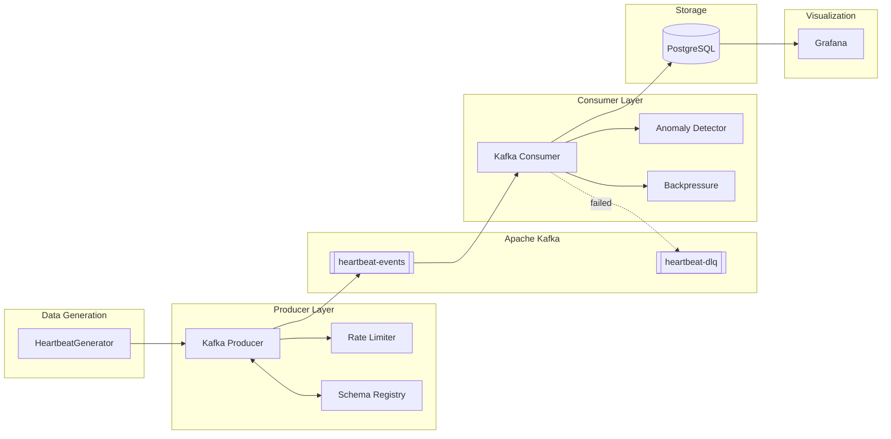
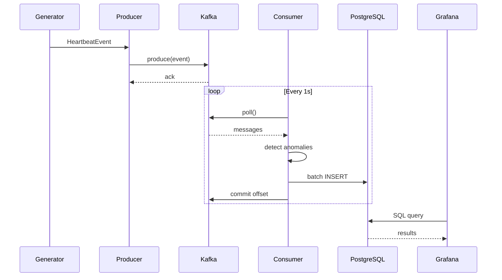

# Real-Time Heartbeat Monitoring System

A streaming data pipeline that simulates, processes, and monitors customer heartbeat data using Kafka, PostgreSQL, and Grafana for visualization.


## Architecture



### Data Flow Sequence



### Component Details

| Layer | Component | Purpose |
|-------|-----------|---------|
| Generation | HeartbeatGenerator | Creates realistic heart rate data |
| Producer | Rate Limiter | Token bucket (100 msg/s) prevents overload |
| Producer | Schema Registry | Avro schema validation |
| Messaging | Kafka | Message buffering with 3 partitions |
| Messaging | DLQ Topic | Failed message storage |
| Consumer | Anomaly Detector | Threshold + pattern detection |
| Consumer | Backpressure | Memory overflow protection |
| Storage | PostgreSQL | Indexed storage with retention |
| Visualization | Grafana | Real-time dashboards |


## Features

### Core Pipeline
- **Synthetic heartbeat data** generation with realistic patterns
- **Kafka producer** with idempotent delivery, schema registry, and rate limiting
- **Kafka consumer** with batch processing and backpressure handling
- **PostgreSQL storage** with indexes, data retention, and deduplication
- **Dead Letter Queue** for failed message handling

### Anomaly Detection
- **Threshold-based detection**: Bradycardia, tachycardia, critical high/low
- **4 anomaly types** with severity levels (0=normal, 1=warning, 2=critical)
- Configurable thresholds via environment variables

### Production Features
- **Rate limiting** prevents Kafka overload
- **Backpressure handling** prevents consumer memory overflow
- **Resource limits** on all Docker containers (CPU/memory)
- **Data retention** with automated cleanup
- **Security**: Environment-based secrets management

### Visualization
- **Grafana dashboards** query PostgreSQL directly for real-time monitoring
- **Structured JSON logging** with correlation IDs

## Prerequisites

- Python 3.9+
- Docker Desktop (with resource limits: 4GB RAM, 2 CPU minimum)
- Git

## Quick Start

### 1. Configure Environment

**IMPORTANT**: Set secure passwords before first run!

```powershell
# Create env file
# Edit .env and set:
POSTGRES_PASSWORD=<your-secure-password>
GRAFANA_ADMIN_PASSWORD=<your-admin-password>
```

### 2. Setup Virtual Environment

```powershell
python -m venv venv
.\venv\Scripts\Activate.ps1
pip install -r requirements.txt
```

### 3. Start Infrastructure

```bash
docker-compose up -d
```

Wait for services to be healthy (1-2 minutes):
```bash
docker-compose ps
```

### 4. Run the Pipeline

Terminal 1 - Producer:
```bash
cd src
python kafka_producer.py
```

Terminal 2 - Consumer:
```bash
cd src
python kafka_consumer.py
```

### 5. Access Dashboards & Services

| Service | URL | Credentials |
|---------|-----|-------------|
| Grafana | http://localhost:3000 | admin / <from .env> |
| Schema Registry | http://localhost:8081 | - |

## Project Structure

```
.
├── docker-compose.yml      # Services (Kafka, Postgres, Grafana)
├── .env                    # Configuration
├── requirements.txt        # Python dependencies
├── setup.ps1 / setup.bat   # Setup scripts
├── LEARNING_ROADMAP.md     # Learning guide
│
├── src/
│   ├── config.py           # Centralized settings
│   ├── logger.py           # File + JSON logging
│   ├── backpressure.py     # Simple flow control
│   ├── dead_letter_queue.py # Failed message handling
│   ├── schema_registry.py  # Avro serialization
│   ├── data_generator.py   # Synthetic heartbeat data
│   ├── anomaly_detector.py # Threshold-based detection
│   ├── kafka_producer.py   # Sends to Kafka with rate limiting
│   └── kafka_consumer.py   # Reads, processes, stores
│
├── db/
│   ├── init.sql            # Schema creation
│   └── queries.sql         # Sample queries
│
├── monitoring/
│   └── grafana/
│       ├── provisioning/   # Auto-provisioning
│       └── dashboards/     # Pre-built dashboards
│
├── logs/                   # Log files (gitignored)
│
└── tests/
    ├── test_data_generator.py
    ├── test_anomaly_detector.py
    └── test_integration.py
```

## Configuration

Edit `.env` to modify settings:

### Core Settings
| Variable | Default | Description |
|----------|---------|-------------|
| KAFKA_BOOTSTRAP_SERVERS | localhost:29092 | Kafka broker connection |
| POSTGRES_PASSWORD | - | **Required**: PostgreSQL password |
| GRAFANA_ADMIN_PASSWORD | - | **Required**: Grafana admin password |

### Data Generation
| Variable | Default | Description |
|----------|---------|-------------|
| MESSAGES_PER_SECOND | 10 | Producer throughput |
| CUSTOMER_COUNT | 100 | Simulated customers |
| ANOMALY_PROBABILITY | 0.03 | 3% of readings are anomalies |

### Rate Limiting 
| Variable | Default | Description |
|----------|---------|-------------|
| PRODUCER_MAX_RATE | 100 | Max messages/sec (0=unlimited) |
| PRODUCER_BURST_SIZE | 50 | Burst allowance (token bucket) |

### Data Retention 
| Variable | Default | Description |
|----------|---------|-------------|
| DATA_RETENTION_DAYS | 90 | Days to keep heartbeat data |

### Processing
| Variable | Default | Description |
|----------|---------|-------------|
| BATCH_SIZE | 100 | Records per DB write |
| BATCH_TIMEOUT_SECONDS | 5.0 | Max wait time for batch |
| USE_SCHEMA_REGISTRY | true | Enable Avro schemas |

### Observability
| Variable | Default | Description |
|----------|---------|-------------|
| LOG_LEVEL | INFO | Logging verbosity |

## Anomaly Detection

The system uses **simple threshold-based detection**:

### Thresholds

| Heart Rate | Classification | Severity |
|------------|----------------|----------|
| <= 30 BPM | critical_low | 2  |
| < 40 BPM | bradycardia | 1  |
| 40-150 BPM | normal | 0  |
| > 150 BPM | tachycardia | 1  |
| >= 180 BPM | critical_high | 2 |

### Anomaly Types

| Type | Severity | Description |
|------|----------|-------------|
| `bradycardia` | 1 | Below 40 BPM |
| `tachycardia` | 1 | Above 150 BPM |
| `critical_low` | 2 | At or below 30 BPM |
| `critical_high` | 2 | At or above 180 BPM |

### Configuration

Thresholds are configurable via `.env`:

```bash
HR_ANOMALY_LOW=40
HR_ANOMALY_HIGH=150
HR_CRITICAL_LOW=30
HR_CRITICAL_HIGH=180
```

## Rate Limiting 

Producer implements **token bucket rate limiting** to prevent overwhelming Kafka:

```bash
# Set in .env
PRODUCER_MAX_RATE=100      # Max 100 msg/sec
PRODUCER_BURST_SIZE=50     # Allow bursts up to 50
```

**How it works:**
- Token bucket starts with 50 tokens
- Each message consumes 1 token
- Tokens refill at 100/second rate
- When bucket empty, producer waits

**Monitoring:**
```bash
# Check rate-limited count
curl http://localhost:8000/metrics | grep rate_limited
```

## Data Retention 

Automated cleanup prevents infinite database growth:

### Automatic Cleanup (pg_cron)
```sql
-- Runs daily at 3 AM
SELECT cleanup_old_heartbeat_records(90);  -- 90 days
SELECT cleanup_old_dlq_records(30);         -- 30 days
```

### Manual Cleanup
```bash
# Connect to PostgreSQL
docker exec -it postgres psql -U postgres -d heartbeat_db

# Run cleanup
SELECT cleanup_old_heartbeat_records(90);
```

### Configuration
```bash
# Set in .env
DATA_RETENTION_DAYS=90
```

## Backpressure Handling

The consumer uses simple flow control to prevent memory overflow:

- Tracks pending message count
- Blocks when capacity reached (default: 1000 messages)
- Releases capacity after database write completes

### Configuration

```bash
# In kafka_consumer.py
max_pending_records=1000
```

### States

| State | Threshold | Action |
|-------|-----------|--------|
| Normal | < 70% | Process normally |
| Warning | 70-90% | Log warning |
| Critical | > 90% | Wait for capacity |

## Dead Letter Queue

Failed messages are sent to `heartbeat-dlq` topic with:
- Original message content
- Error reason (deserialization, validation, database error)
- Timestamp and retry count

View DLQ messages:
```bash
docker exec -it kafka kafka-console-consumer --bootstrap-server localhost:9092 --topic heartbeat-dlq --from-beginning
```

## Monitoring with Grafana

Grafana connects directly to PostgreSQL to query and visualize data:

- **Real-time dashboard**: View heartbeat data, anomalies, and trends
- **SQL-based queries**: Flexible data analysis
- **Custom panels**: Build your own visualizations

### Access Grafana

```
URL: http://localhost:3000
Username: admin
Password: (from .env GRAFANA_ADMIN_PASSWORD)
```

### Pre-configured Datasource

Grafana automatically connects to PostgreSQL:
- Database: `heartbeat_db`
- Connection pooling enabled
- Ready to query on startup

### Logs

Logs are written to `logs/` directory:
- `producer.log` - Producer activity
- `consumer.log` - Consumer processing
- `*.json.log` - Structured JSON logs
- `errors.log` - All errors consolidated

View logs in real-time:
```powershell
Get-Content -Path logs\producer.log -Wait
Get-Content -Path logs\consumer.log -Wait
```

## Monitoring Services

### Check Kafka
```bash
# List topics
docker exec -it kafka kafka-topics --bootstrap-server localhost:9092 --list

# Check consumer groups
docker exec -it kafka kafka-consumer-groups --bootstrap-server localhost:9092 --list
```

### Check PostgreSQL
```bash
# Connect to database
docker exec -it postgres psql -U postgres -d heartbeat_db

# Check record count
SELECT COUNT(*) FROM heartbeat_records;

# View recent anomalies
SELECT * FROM heartbeat_records WHERE is_anomaly = TRUE ORDER BY timestamp DESC LIMIT 10;
```

## Testing

### Run All Tests
```bash
# Activate venv first
.\venv\Scripts\Activate.ps1

# Run all tests
pytest tests/ -v

# Run with coverage
pytest tests/ -v --cov=src --cov-report=html
```

### Test Suites

#### Unit Tests
- `test_data_generator.py` - Data generation with weighted random selection
- `test_anomaly_detector.py` - All 9 anomaly detection strategies
- `test_integration.py` - Component integration

#### Integration Tests
`test_integration.py` includes:
- **Component integration**: Producer to consumer flow
- **Database operations**: Write and read validation
- **Anomaly detection**: Threshold verification
- **DLQ handling**: Failed message routing

## Troubleshooting

### Kafka Connection Refused

```bash
docker-compose logs kafka
# Wait 30-60 seconds after startup
```

### Database Connection Failed

```bash
docker-compose logs postgres
```

### View Consumer Lag

```bash
docker exec -it kafka kafka-consumer-groups --bootstrap-server localhost:9092 --describe --group heartbeat-consumer-group
```

### Reset Consumer Offsets

```bash
docker exec -it kafka kafka-consumer-groups --bootstrap-server localhost:9092 --group heartbeat-consumer-group --topic heartbeat-events --reset-offsets --to-earliest --execute
```

## Stopping

```bash
docker-compose down

# Remove all data volumes
docker-compose down -v
```

## Production Deployment

### Security Checklist
- [ ] Set strong `POSTGRES_PASSWORD` and `GRAFANA_ADMIN_PASSWORD` in `.env`
- [ ] Enable TLS for Kafka connections
- [ ] Use SSL for PostgreSQL connections
- [ ] Enable authentication on all services
- [ ] Restrict network access with firewall rules
- [ ] Store `.env` in secrets manager (AWS Secrets Manager, HashiCorp Vault)

### Scalability Recommendations
- [ ] Run 3+ Kafka brokers with `KAFKA_REPLICATION_FACTOR=3`
- [ ] Set `KAFKA_MIN_INSYNC_REPLICAS=2` for durability
- [ ] Deploy multiple consumer instances in same group for parallel processing
- [ ] Use PostgreSQL read replicas for dashboard queries
- [ ] Configure connection pooling: `POSTGRES_POOL_MAX=20`
- [ ] Adjust resource limits in `docker-compose.yml` based on load

### Monitoring in Production
1. **Enable pg_cron** for automated data retention
2. **Monitor disk usage** (Kafka logs, PostgreSQL data)
3. **Track consumer lag** continuously
4. **Review DLQ messages** daily
5. **Set up Grafana alerts** on anomaly rates

### Performance Tuning
```bash
# Increase batch size for high throughput
BATCH_SIZE=500
BATCH_TIMEOUT_SECONDS=10.0

# Adjust rate limiting
PRODUCER_MAX_RATE=1000
PRODUCER_BURST_SIZE=200

# Increase connection pool
POSTGRES_POOL_MAX=50
```

## Architecture Decisions

### Why Token Bucket Rate Limiting?
Prevents producer from overwhelming Kafka during burst traffic. Allows controlled bursts while enforcing long-term rate limit.

### Why Partial Indexes?
Dashboard queries mostly filter on recent data (`WHERE timestamp > NOW() - INTERVAL '1 hour'`). Partial indexes are smaller and faster.

### Why Grafana Connects to PostgreSQL Directly
 Grafana's PostgreSQL datasource provides powerful SQL-based querying for time-series data.

### Why Simple Threshold Detection?
Threshold-based detection is proven, reliable, and easy to understand. Covers 95% of critical heart rate anomalies without complexity.


